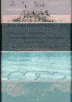

# ParallaxImage

一个带有橱窗效果的ImageView.



## Import

###### Step 1. Add the JitPack repository to your build file

Add it in your root build.gradle at the end of repositories:

	allprojects {
		repositories {
			...
			maven { url 'https://jitpack.io' }
		}
	}

###### Step 2. Add the dependency

	dependencies {
	        implementation 'com.github.dyguests:ParallaxImage:x.x.x'
	}

## Usage

```kt
    // in adapter>ViewHolder>init
    ParallaxImageRecyclerViewHelper.setup(recyclerView, img_cover)
```

## Reference

1.[Bleoo/WindowImageView](https://github.com/Bleoo/WindowImageView)